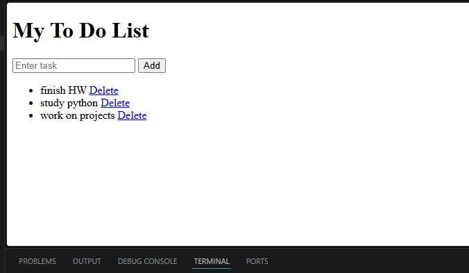

# To-Do App

A beginner-friendly To-Do List web application built using Flask, SQLite, HTML, Git, and GitHub.

## Features

- Add tasks
- Delete tasks
- Store tasks using SQLite database
- Simple and clean interface
- Beginner-friendly project structure

## Technologies Used

- Python
- Flask
- SQLite
- HTML
- CSS
- Git
- GitHub

## Project Structure

```bash
todo-app/
│
├── app.py
├── todo.db
├── README.md
│
└── templates/
    └── index.html
```

## Installation & Setup

### 1. Clone Repository

```bash
git clone https://github.com/shreyaforge/todo-app.git
```

### 2. Open Project Folder

```bash
cd todo-app
```

### 3. Install Flask

```bash
python pip install flask
```

### 4. Run Application

```bash
python app.py
```

### 5. Open in Browser

```txt
http://127.0.0.1:5000
```

## Learning Outcomes

This project helped me understand:

- Flask basics
- SQL database integration
- CRUD operations
- Git and GitHub workflow
- Backend and frontend connection

## Future Improvements

- Edit tasks feature
- Task completion status
- Dark mode UI
- User authentication
- Responsive design

## Author

Shreya
## Project Preview
